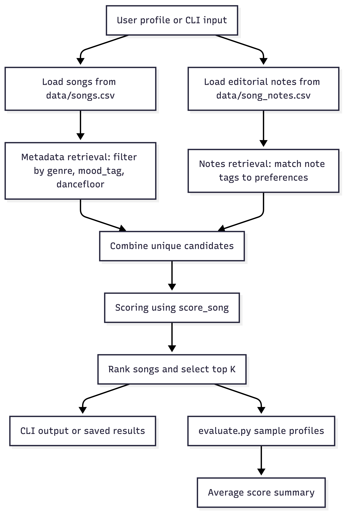
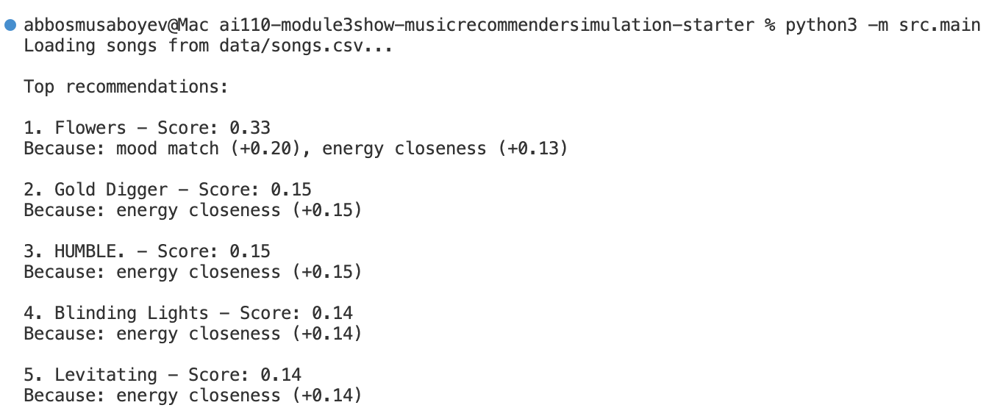

# 🎵 Music Recommender Simulation

## Project Summary

This project builds a small music recommender system that ranks songs from a structured CSV catalog. It compares a user taste profile against song features such as genre, mood, energy, valence, danceability, acousticness, and additional tags.

The original project scope is a rule-based recommender that scores every song and returns the top results. My version extends that baseline with custom multi-attribute retrieval, an evaluation script, and fallback guardrails so the system is easier to explain and more reliable.

---

## How The System Works

My recommender uses a small taste profile and compares it against the features in `data/songs.csv`. Each song has `genre`, `mood`, `energy`, `valence`, `danceability`, `acousticness`, and `tempo_bpm`. The user profile stores the listener’s preferred genres, preferred mood, and target values for the numeric features.

The scoring rule gives the most weight to genre, then mood, then the numeric features. A song gets more points when its genre or mood matches the user profile, and when its numeric values are close to the target values in the user profile. This means the system rewards songs that feel similar to what the user asked for instead of only preferring bigger or smaller numbers.

The ranking rule is simple: score every song, sort the songs from highest score to lowest score, and return the top `K` songs. That makes the final recommendation list easy to understand and easy to explain.

I also added custom multi-source retrieval over the structured song dataset and a second editorial notes file. Before scoring, the recommender filters candidates by fields like `genre`, `mood_tag`, and `dancefloor`, and it also checks matching tags in `data/song_notes.csv` to widen retrieval beyond a single source.

## New AI Feature

I introduced a retrieval stage that filters relevant songs before scoring, simulating a Retrieval-Augmented Generation style pipeline without using an LLM. This is implemented in `src/recommender.py` through `retrieve_candidates()`, which combines the main catalog with a second editorial notes source before the ranking step.

## Evaluation

I built an evaluation script that tests the recommender across multiple user profiles and computes average recommendation scores. This gives a simple but repeatable way to compare behavior across different preferences and mode settings.

## Architecture Diagram





Final algorithm recipe:

```text
score =
0.40 * genre_match
0.20 * mood_match
0.15 * energy_closeness
0.10 * valence_closeness
0.10 * danceability_closeness
0.05 * acousticness_closeness
```

One limitation of this design is that it can over-prioritize genre and mood, which may hide songs that fit the user’s vibe well but come from a different genre. It also depends on the quality of the taste profile, so if the user gives vague answers, the recommendations may be less accurate.

---


## Experiments

I tried different scoring modes and compared how the ranking changed for several user profiles. I also tested the retrieval stage by using multiple preference fields, which made the final recommendation list more focused for some profiles and more restrictive for others.

---
## CLI Verification

I ran `python -m src.main` and confirmed the recommender prints a ranked list of songs.



I also saved the terminal output here: [output.txt](output.txt)

## Demo Walkthrough

Loom video walkthrough: https://www.loom.com/share/0ff3d9fabb67411189398f8315e9af9e

### Saved Outputs

I used text files here instead of screenshots because they were faster to save and easier to compare.

- [Original output](output.txt)
- [Mood-based output](mood_based_output.txt)
- [Genre-first output](genre_first_output.txt)
- [Mood-first output](mood_first_output.txt)

### Challenge Summary

I completed Challenge 1, Challenge 2, and Challenge 4. Challenge 3 is still not fully implemented because I did not add a real diversity penalty for repeated artists or genres.


## Limitations and Risks

The recommender only works on a small structured catalog, so it does not understand lyrics, artist context, or real semantic similarity. It can also over-favor certain genres or moods when the user profile is specific, and the fallback behavior may surface songs that are only loosely related to the request.


---

## Reflection

[**Model Card**](model_card.md)

I learned that even a simple recommender can behave quite differently depending on feature weights and retrieval rules. Small changes to the scoring logic can shift the ranking a lot, which made it clear why recommendation systems need careful evaluation.

I also saw how bias can enter through the dataset and the feature design. If the catalog is small or skewed toward mainstream music, the recommender can narrow results too much and miss songs that fit the user's taste in a less obvious way.
